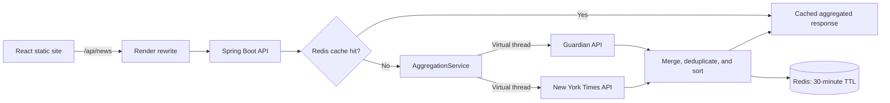

# News Aggregator

A full-stack news search application that combines reporting from **The Guardian** and **The New York Times** behind one Spring Boot API. The backend searches providers concurrently, caches aggregated responses in Redis, removes duplicate articles, and degrades gracefully when a provider or cache is unavailable.

## Features

- Search both news providers through one API and one React interface.
- Run provider requests concurrently with Java 21 virtual threads.
- Cache complete search results and pagination metadata in Redis.
- Return repeated searches from Redis without calling either external API again.
- Normalize article URLs, remove duplicates, and sort newest stories first.
- Continue serving results when one provider fails or Redis is temporarily unavailable.
- Treat `latest` and `latest-news` as aliases for provider-native newest stories.
- Return `503 Service Unavailable` with a clear message when no provider succeeds.
- Apply connection, read, and overall provider timeouts.
- Validate pagination parameters and limit responses to 25 articles.
- Display responsive loading, error, retry, pagination, and dark-mode states.
- Deploy the frontend, backend, and Redis-compatible cache on Render's free tier.

## Architecture



### Request flow

1. React requests `/api/news?keyword=java&page=1&pageSize=12`.
2. Render rewrites the same-origin request to the public Spring Boot service.
3. `NewsController` validates request parameters and calls `AggregationService`.
4. `CacheService` checks Redis using a key derived from the keyword, page, and page size.
5. A cache hit returns stored articles and pagination metadata immediately.
6. A cache miss starts Guardian and NYT calls concurrently.
7. The aggregator merges results, normalizes URLs, removes duplicates, sorts articles by publication date, and applies the requested page size.
8. A successful aggregated result is stored in Redis and returned to the client.

## Low-level design and design patterns

### Strategy pattern: interchangeable news providers

`NewsProviderClient` defines the contract shared by all providers:

```java
public interface NewsProviderClient {
    String getProviderName();
    NewsApiResult search(String keyword, int page, int pageSize);
}
```

`GuardianClient` and `NytClient` implement that contract. Spring injects every implementation as `List<NewsProviderClient>`, allowing `AggregationService` to work with providers through their shared abstraction.

To add another provider, implement `NewsProviderClient` and register it as a Spring component. Existing aggregation logic does not need a new provider-specific branch for the provider to participate; unknown providers are enabled by default. Existing Guardian/NYT feature toggles are configured separately.

### Adapter pattern: normalize incompatible external APIs

The Guardian and NYT expose different URLs, request parameters, JSON schemas, pagination conventions, and article fields. Each provider client adapts its API-specific response into the application's common domain records:

```java
public record NewsApiResult(
    int totalResults,
    int totalPages,
    List<NewsArticle> articles
) {}
```

```java
public record NewsArticle(
    String title,
    String description,
    String url,
    String source,
    String publishedAt,
    String imageUrl
) {}
```

The rest of the application never needs to understand Guardian-specific or NYT-specific payload structures.

### Facade and aggregation: one API for multiple integrations

`AggregationService` provides a single application-level operation that coordinates provider selection, concurrency, caching, deduplication, sorting, pagination, and fallback behavior. `NewsController` and the React frontend remain independent of provider integration details.

### Cache-aside: faster repeated searches

The application uses a cache-aside workflow:

```text
Search request
      |
      v
Read Redis by keyword + page + page size
      |
      +-- Cache hit  --> Return cached result; no external HTTP requests
      |
      +-- Cache miss --> Search Guardian and NYT concurrently
                            |
                            v
                       Save merged result in Redis
                            |
                            v
                       Return response
```

The default Redis TTL is **30 minutes**, configurable through `NEWS_CACHE_TTL`. Cached values include pagination metadata, so a cache hit preserves the same next-page behavior as a live response.

Redis reduces repeated upstream requests, provider quota consumption, response latency, and CPU/network usage on Render's constrained free instance. If Redis is unavailable, the application logs the failure and continues with live provider requests.

### Fan-out/fan-in with Java 21 virtual threads

Provider requests are submitted concurrently using `CompletableFuture` and a virtual-thread executor:

```java
Executors.newVirtualThreadPerTaskExecutor()
```

Each provider receives its own task. A failed or timed-out provider is excluded when another provider succeeds. If every enabled provider fails, the API returns `503 Service Unavailable` with a configuration hint instead of returning a misleading empty response.

### SOLID principles

- **Single responsibility:** controllers handle HTTP, provider clients handle integration, the aggregator coordinates searches, and `CacheService` handles cache access.
- **Open/closed:** new providers can implement `NewsProviderClient` without rewriting the existing aggregator.
- **Dependency inversion:** aggregation depends on the provider interface instead of concrete Guardian or NYT classes.
- **Interface segregation:** the provider contract exposes only its name and search operation.

## Technology stack

| Area | Technology |
| --- | --- |
| Backend | Java 21, Spring Boot 3.5, Spring Web |
| External integrations | Spring Cloud OpenFeign |
| Concurrency | `CompletableFuture`, Java 21 virtual threads |
| Caching | Spring Cache, Redis, JSON serialization |
| Validation and health | Bean Validation, Spring Boot Actuator |
| Frontend | React 18, Axios |
| Packaging | Gradle, multi-stage Docker build |
| Hosting | Render Static Site, Render Web Service, Render Key Value |
| Optional CI | Jenkins |

## Repository structure

```text
news_aggregator/
├── backend/
│   ├── Dockerfile
│   ├── build.gradle
│   └── src/
│       ├── main/java/com/example/news/
│       │   ├── client/
│       │   │   ├── guardian/ # Guardian adapter and Feign client
│       │   │   └── nyt/      # NYT adapter and Feign client
│       │   ├── config/       # Redis, virtual threads, CORS, and OpenAPI
│       │   ├── controller/   # Search API
│       │   ├── model/        # Immutable article and response records
│       │   └── service/      # Aggregation and cache-aside orchestration
│       ├── main/resources/application.yaml
│       └── test/java/com/example/news/service/
├── frontend/
│   ├── package.json
│   └── src/features/news/
│       ├── api/
│       └── components/
├── Jenkinsfile
└── render.yaml
```

## Run locally

### Prerequisites

- Java 21.
- Node.js 22.
- A locally running Redis instance or another accessible Redis-compatible endpoint.
- Guardian and NYT developer API keys.

### Start the backend

macOS/Linux:

```bash
export GUARDIAN_API_KEY="your-guardian-key"
export NYT_API_KEY="your-nyt-key"

cd backend
./gradlew bootRun
```

Windows PowerShell:

```powershell
$env:GUARDIAN_API_KEY = "your-guardian-key"
$env:NYT_API_KEY = "your-nyt-key"

cd backend
.\gradlew.bat bootRun
```

Environment variables apply only to processes started from that PowerShell window. If the backend is started from IntelliJ, add `GUARDIAN_API_KEY` and `NYT_API_KEY` under **Run/Debug Configuration → Environment variables**, then restart the application.

The backend validates this configuration during startup. It starts when at least one enabled provider has an API key and fails immediately with a configuration message when neither key is available.

The default Redis endpoint is `redis://localhost:6379`. Override it if necessary:

```bash
export REDIS_URL="redis://localhost:6379"
```

The application can still retrieve live articles if Redis is temporarily unavailable, but caching will not work until Redis reconnects.

### Start the frontend

```bash
cd frontend
npm ci
npm start
```

Open `http://localhost:3000`. During local development, the React proxy forwards `/api` requests to `http://localhost:8080`.

### Run backend tests

```bash
cd backend
./gradlew test
```

### Build the frontend

```bash
cd frontend
npm ci
npm run build
```

## API

### Search articles

```http
GET /api/news?keyword=java&page=1&pageSize=12
```

| Parameter | Default | Description |
| --- | --- | --- |
| `keyword` | `latest` | Search term sent to both providers. `latest` and `latest-news` request provider-native newest stories. |
| `page` | `1` | One-based result page. |
| `pageSize` | `10` | Maximum articles returned; allowed range: 1–25. |

Example:

```bash
curl "http://localhost:8080/api/news?keyword=java&page=1&pageSize=12"
```

Latest stories do not require a literal search phrase:

```bash
curl "http://localhost:8080/api/news?page=1&pageSize=10"
```

`keyword=latest` and the older `keyword=latest-news` form produce the same request. The backend omits the provider query term and asks each provider for its newest articles.

Redis does not download news. It stores only successful provider responses. On the first request for a search key, at least one enabled provider must have a valid API key and complete successfully. If every provider fails, the API returns `503` instead of a misleading empty `200` response.

Health endpoints:

```text
/actuator/health
/actuator/health/liveness
/actuator/health/readiness
```

Render checks the liveness endpoint so a temporary Redis outage does not incorrectly mark the entire application as unavailable.

Swagger UI is disabled by default. Enable it only in a trusted development environment:

```bash
export SWAGGER_ENABLED=true
```

## Free Render deployment

The root `render.yaml` Blueprint creates three services:

| Service | Render type | Plan | Purpose |
| --- | --- | --- | --- |
| `abhay123abhi-news-web` | Static Site | Free | React production build and same-origin API rewrites. |
| `abhay123abhi-news-api` | Docker Web Service | Free | Java 21 Spring Boot API. |
| `abhay123abhi-news-cache` | Key Value | Free | Redis-compatible cache with LRU eviction. |

### Deploy

1. Sign in to Render and select **New → Blueprint**.
2. Connect the `Abhay123abhi/news_aggregator` GitHub repository.
3. Select the branch containing `render.yaml`.
4. Enter `GUARDIAN_API_KEY` and `NYT_API_KEY` when Render prompts for secrets.
5. Confirm that both the API service and Key Value instance use the Singapore region.
6. Create the Blueprint and wait for the cache, backend, and frontend to deploy.
7. Open the frontend URL and search for a topic.

Render populates `REDIS_URL` automatically using the Key Value instance's private connection string. The frontend calls `/api/news`; its static-site rewrite forwards the request to the backend, so no frontend API environment variable is required.

If Render assigns service URLs different from those shown in `render.yaml`, update both the frontend rewrite destination and `CORS_ALLOWED_ORIGINS` accordingly.

### Free-tier behavior

- Free backend instances sleep after inactivity; the next request can take about a minute.
- The frontend allows up to 90 seconds for a response and explains when the server is waking up.
- Free Key Value instances are in-memory only and can lose cached entries on restart.
- Render allows only one free Key Value instance per workspace.
- Free services remain subject to Render's monthly instance-hour, build-minute, and bandwidth limits.
- No PostgreSQL instance, Kubernetes cluster, paid background worker, or hosted Jenkins server is required.
- Guardian and NYT API usage remains subject to each provider's developer-key limits.

### Why there is no hourly WebSocket refresh

This deployment intentionally uses on-demand HTTP requests instead of WebSockets or scheduled hourly refreshes. A free Render backend can sleep when inactive, so an in-process scheduler cannot guarantee hourly execution while the service is asleep. Render background workers and cron jobs also do not offer the same free service plan.

The cache-aside design provides a simpler fit for the free tier: articles refresh when users search after the configurable Redis TTL expires. Unused STOMP and SockJS application dependencies have been removed.

## Configuration reference

| Variable | Required on Render | Default | Purpose |
| --- | --- | --- | --- |
| `GUARDIAN_API_KEY` | Yes | Empty | Guardian developer API key. |
| `NYT_API_KEY` | Yes | Empty | NYT developer API key. |
| `REDIS_URL` | Automatically configured | `redis://localhost:6379` | Redis connection URL. |
| `PORT` | Automatically configured | `8080` | HTTP port assigned by Render. |
| `CORS_ALLOWED_ORIGINS` | Configured in Blueprint | `http://localhost:3000` | Permitted browser origin. |
| `NEWS_CACHE_TTL` | No | `30m` | Cached search-result lifetime. |
| `NODE_VERSION` | Configured in Blueprint | `22` | Frontend build runtime. |
| `SWAGGER_ENABLED` | No | `false` | Enables Swagger UI for trusted development. |
