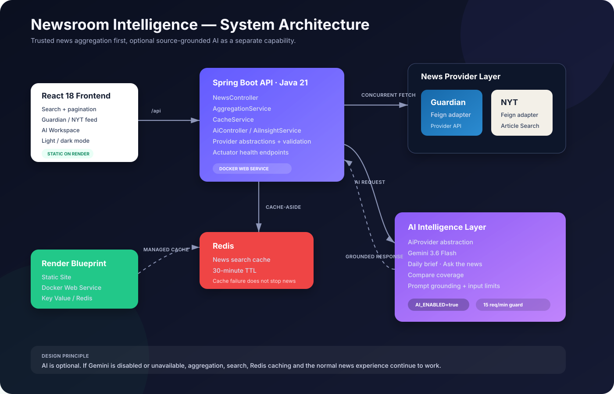

# Newsroom Intelligence

A full-stack news aggregation and AI-assisted reading workspace built with **Java 21, Spring Boot, React, Redis, The Guardian API, The New York Times API, and Gemini**.

The project started as a straightforward aggregator. The interesting part came later: keeping aggregation reliable and independent, then adding AI as an optional intelligence layer instead of making the whole product depend on an LLM.

The result is a small system that can:

- search multiple publishers through one API,
- fan out provider calls concurrently,
- normalize and deduplicate responses,
- cache repeated searches in Redis,
- keep serving news when one provider or Redis has a problem,
- generate a daily AI brief from the current feed,
- answer questions using only the articles already retrieved,
- compare observable differences in coverage across publishers,
- switch AI off at runtime without breaking the core news experience.

## Architecture



The main design decision is simple: **news aggregation is the core product; AI is an optional capability on top of it.**

If `AI_ENABLED=false`, the Guardian + NYT flow continues to work normally. If Gemini is unavailable or the key is missing, the user can still search, paginate, read, and benefit from Redis caching.

## What I built

### News aggregation

The backend exposes one search API and hides provider-specific details from the frontend.

A request such as:

```http
GET /api/news?keyword=technology&page=1&pageSize=12
```

is handled as:

```text
React
  |
  v
NewsController
  |
  v
Redis lookup
  |
  +---- hit ----> cached aggregated result
  |
  +---- miss
          |
          v
   AggregationService
      /         \
 Guardian       NYT
      \         /
       merge + dedupe
            |
            v
          Redis
            |
            v
         response
```

Guardian and NYT are called concurrently. Their responses are mapped into the same `NewsArticle` model, normalized, deduplicated and sorted by publication time before they reach the UI.

### AI intelligence layer

AI is deliberately separated from `AggregationService`.

The backend currently supports:

- **Daily AI brief** — compact overview of the important developments in the current feed.
- **Ask the news** — question answering grounded only in the articles shown to the user.
- **Compare coverage** — compares common ground, different emphasis and missing context across retrieved publishers.
- **Article summary** — backend capability for concise article summaries.
- **Why it matters** — backend capability that explains significance without inventing unsupported context.

The flow is:

```text
Current Guardian + NYT articles
          |
          v
     AiController
          |
          v
   AiInsightService
          |
          +--> prompt grounding / input limits
          +--> request-per-minute protection
          +--> 30-minute response cache
          |
          v
      AiProvider
          |
          v
   Gemini 3.6 Flash
```

The browser never sees the Gemini API key. It only calls `/api/ai/*` on the Spring Boot backend.

### Graceful AI fallback

AI can be disabled at any time:

```text
AI_ENABLED=false
```

After restart/redeploy:

- AI workspace shows **Offline**,
- Gemini calls stop,
- Guardian + NYT search still works,
- Redis caching still works,
- pagination and the normal UI still work.

This makes AI a feature flag rather than a critical dependency.

## Technology stack

| Area | Technology |
| --- | --- |
| Backend | Java 21, Spring Boot 3.5 |
| HTTP integrations | Spring Cloud OpenFeign, Spring `RestClient` |
| Concurrency | `CompletableFuture`, Java 21 virtual threads |
| Caching | Spring Cache, Redis |
| AI | Gemini 3.6 Flash behind `AiProvider` abstraction |
| Validation / health | Bean Validation, Spring Boot Actuator |
| Frontend | React 18, Axios |
| Build | Gradle, npm |
| Packaging | Docker multi-stage build |
| Deployment | Render Static Site, Docker Web Service, Render Key Value |
| CI option | Jenkins |

## High-level design

At HLD level the system has four responsibilities:

1. **Frontend** — search, feed presentation, pagination, AI workspace and status.
2. **Aggregation backend** — provider orchestration, normalization, fallback and cache-aside logic.
3. **External integrations** — Guardian, NYT and Gemini.
4. **Infrastructure** — Redis, Docker and Render deployment.

A few choices were intentional:

- No direct third-party API calls from React.
- No API keys in frontend code.
- No hard dependency between news retrieval and AI.
- No scheduler/WebSocket requirement for the free Render deployment.
- No database because the application does not currently own long-lived business data.
- Redis is used for short-lived repeated-query acceleration, not as a source of truth.

## Low-level design and patterns

### Strategy pattern — provider abstraction

```java
public interface NewsProviderClient {
    String getProviderName();
    NewsApiResult search(String keyword, int page, int pageSize);
}
```

`GuardianClient` and `NytClient` implement the same contract. `AggregationService` depends on the interface rather than concrete providers.

That keeps the aggregator open for a future Reuters, NewsAPI or another provider without turning the service into a long provider-specific `if/else` chain.

### Adapter pattern — one domain model

Guardian and NYT return different JSON structures. Each integration adapts its response to the shared model:

```java
public record NewsArticle(
    String title,
    String description,
    String url,
    String source,
    String publishedAt,
    String imageUrl
) {}
```

The rest of the backend and the React app work with this model instead of knowing provider-specific payload shapes.

### Facade / orchestration

`AggregationService` acts as the application-level facade for:

- provider selection,
- concurrent fetches,
- timeout handling,
- result merging,
- URL normalization,
- deduplication,
- sorting,
- pagination,
- fallback behavior.

### Cache-aside

Repeated searches do not need to hit both upstream APIs every time.

```text
request -> Redis
           |
        cache hit ----------------> response
           |
        cache miss
           |
      providers
           |
     aggregate result
           |
       save Redis
           |
        response
```

Default news cache TTL is **30 minutes** and can be changed with `NEWS_CACHE_TTL`.

If Redis is temporarily unavailable, the application falls back to live provider requests instead of failing the entire request.

### Fan-out / fan-in

Provider calls are executed concurrently using Java 21 virtual threads with `CompletableFuture` orchestration.

This fits the workload well because the tasks are mostly waiting on external HTTP calls.

### AI provider abstraction

AI follows the same dependency-inversion idea:

```java
public interface AiProvider {
    String generate(String systemPrompt, String userPrompt);
    String modelName();
    boolean isConfigured();
}
```

`GeminiAiProvider` is one implementation. `AiInsightService` does not need to know Gemini-specific HTTP details.

A future OpenAI, Groq or local Ollama implementation can be added behind the same interface without changing controllers or the frontend contract.

### AI safety and quota controls

The current AI layer includes a few practical controls:

- article content is treated as untrusted prompt data,
- titles, descriptions, URLs and questions are length-bounded,
- the model is explicitly instructed to use only supplied evidence,
- unsupported questions should be rejected rather than invented,
- AI requests have an application-side requests-per-minute guard,
- repeated identical AI requests can reuse a 30-minute in-memory result cache,
- the API key stays server-side.

## Repository structure

```text
news_aggregator/
├── backend/
│   ├── Dockerfile
│   ├── build.gradle
│   └── src/
│       ├── main/java/com/example/news/
│       │   ├── ai/              # AI provider + AI orchestration
│       │   ├── client/
│       │   │   ├── guardian/    # Guardian adapter
│       │   │   └── nyt/         # NYT adapter
│       │   ├── config/          # Redis, CORS, executors, OpenAPI
│       │   ├── controller/      # News + AI REST endpoints
│       │   ├── model/           # Shared records
│       │   └── service/         # Aggregation + caching
│       ├── main/resources/application.yaml
│       └── test/
├── frontend/
│   └── src/
│       ├── features/news/
│       └── features/ai/
├── docs/
│   └── architecture.svg
├── Jenkinsfile
└── render.yaml
```

## Run locally

### Prerequisites

Install:

- Java 21
- Node.js 22
- Redis running locally on `6379`
- Guardian API key
- NYT API key
- Gemini API key if you want AI enabled

At least one news provider key is required for backend startup. Using both gives the intended aggregator behavior.

### Environment variables

Windows PowerShell example:

```powershell
$env:GUARDIAN_API_KEY="your-guardian-key"
$env:NYT_API_KEY="your-nyt-key"
$env:GEMINI_API_KEY="your-gemini-key"
$env:GEMINI_MODEL="gemini-3.6-flash"
$env:AI_ENABLED="true"
$env:AI_REQUESTS_PER_MINUTE="15"
$env:REDIS_URL="redis://localhost:6379"
```

macOS/Linux:

```bash
export GUARDIAN_API_KEY="your-guardian-key"
export NYT_API_KEY="your-nyt-key"
export GEMINI_API_KEY="your-gemini-key"
export GEMINI_MODEL="gemini-3.6-flash"
export AI_ENABLED="true"
export AI_REQUESTS_PER_MINUTE="15"
export REDIS_URL="redis://localhost:6379"
```

Do not commit real API keys to `application.yaml`, `render.yaml`, React code or GitHub.

For day-to-day local development, IntelliJ Run/Debug Configuration environment variables are more convenient than retyping PowerShell variables after every restart.

### Start backend

Windows:

```powershell
cd backend
.\gradlew.bat bootRun
```

macOS/Linux:

```bash
cd backend
./gradlew bootRun
```

A running Gradle `bootRun` task may stay at something like `80% EXECUTING`. That is normal while Spring Boot is serving requests.

Backend health:

```text
http://localhost:8080/actuator/health
```

AI status:

```text
http://localhost:8080/api/ai/status
```

### Start frontend

```bash
cd frontend
npm ci
npm start
```

Open:

```text
http://localhost:3000
```

The React development proxy forwards `/api` calls to `http://localhost:8080`.

### Disable AI locally

```powershell
$env:AI_ENABLED="false"
```

Restart the backend. The news application remains usable and the AI workspace reports Offline.

## API examples

### Search

```http
GET /api/news?keyword=java&page=1&pageSize=12
```

### AI status

```http
GET /api/ai/status
```

Example:

```json
{
  "enabled": true
}
```

### Daily brief

```http
POST /api/ai/brief
Content-Type: application/json
```

```json
{
  "articles": [
    {
      "title": "...",
      "description": "...",
      "url": "...",
      "source": "Guardian",
      "publishedAt": "...",
      "imageUrl": null
    }
  ]
}
```

### Ask the news

```http
POST /api/ai/ask
```

```json
{
  "question": "What are the biggest technology developments in this feed?",
  "articles": []
}
```

### Compare coverage

```http
POST /api/ai/compare
```

The React application builds these payloads automatically from the current feed.

## Tests and builds

Backend tests:

```bash
cd backend
./gradlew test
```

Frontend production build:

```bash
cd frontend
npm ci
npm run build
```

## Docker

The backend includes a multi-stage Dockerfile. Render builds the same Docker image used for production deployment.

You can build it locally with:

```bash
cd backend
docker build -t newsroom-intelligence-api .
```

Then run it with the required environment variables and access the API on the exposed application port.

Redis is intentionally external to the backend image so the application can use either a local Redis instance or Render Key Value without changing application code.

## Render deployment

The root `render.yaml` defines the deployment as a Render Blueprint:

| Service | Render type | Purpose |
| --- | --- | --- |
| `abhay123abhi-news-web` | Static Site | React build and `/api/*` rewrite |
| `abhay123abhi-news-api` | Docker Web Service | Spring Boot API |
| `abhay123abhi-news-cache` | Key Value | Redis-compatible cache |

### Deploy from GitHub

1. Push/merge the code to the branch you want to deploy.
2. In Render select **New → Blueprint**.
3. Connect this GitHub repository.
4. Render reads `render.yaml` and creates the frontend, backend and Redis-compatible cache.
5. Add secret values when prompted:
   - `GUARDIAN_API_KEY`
   - `NYT_API_KEY`
   - `GEMINI_API_KEY`
6. Keep:

```text
AI_ENABLED=true
GEMINI_MODEL=gemini-3.6-flash
AI_REQUESTS_PER_MINUTE=15
```

7. Deploy the Blueprint.

The frontend uses a same-origin `/api/*` rewrite to the Spring backend, so API secrets never need to be present in the React build.

### Emergency AI switch

If AI quota, provider availability or another issue occurs in production, change the backend Render environment variable to:

```text
AI_ENABLED=false
```

Redeploy/restart the backend.

No frontend code change is needed and the normal news product continues to work.

### Free-tier behavior

The project was deliberately kept compatible with lightweight/free hosting:

- Render web services may sleep after inactivity,
- the first request after sleep can therefore be slower,
- Redis cache content is disposable,
- no Kubernetes cluster is required,
- no PostgreSQL database is required,
- no always-running scheduler is required,
- no paid background worker is required.

This is also why the current product uses user-driven retrieval rather than pretending an in-process scheduler can reliably refresh news every hour while a free instance is asleep.

## Configuration

| Variable | Default | Purpose |
| --- | --- | --- |
| `GUARDIAN_API_KEY` | empty | Guardian API authentication |
| `NYT_API_KEY` | empty | NYT API authentication |
| `GEMINI_API_KEY` | empty | Backend-only Gemini authentication |
| `GEMINI_MODEL` | `gemini-3.6-flash` | AI model |
| `AI_ENABLED` | `true` | Runtime AI feature switch |
| `AI_REQUESTS_PER_MINUTE` | `15` | Backend AI request guard |
| `REDIS_URL` | `redis://localhost:6379` | Redis connection |
| `NEWS_CACHE_TTL` | `30m` | Search result cache lifetime |
| `NEWS_CONNECT_TIMEOUT_MS` | `10000` | News provider connection timeout |
| `NEWS_READ_TIMEOUT_MS` | `20000` | News provider read timeout |
| `NEWS_PROVIDER_TIMEOUT` | `35s` | Overall provider task timeout |
| `CORS_ALLOWED_ORIGINS` | `http://localhost:3000` | Allowed browser origin |
| `SWAGGER_ENABLED` | `false` | Swagger UI toggle |

## Failure behavior

A few failure cases are handled intentionally rather than hidden:

| Failure | Behavior |
| --- | --- |
| Guardian fails | NYT results can still be returned |
| NYT fails | Guardian results can still be returned |
| Both news providers fail | API returns a clear service-unavailable response |
| Redis fails | live provider calls continue |
| Gemini unavailable | AI request fails, core news still works |
| `AI_ENABLED=false` | AI is offline; core news remains available |
| Missing Gemini key | AI status is disabled; key is never exposed to frontend |

## Why AI improves this project

Without AI this is a reliable multi-source aggregator. With AI it becomes a small **news intelligence workspace**.

The important difference is that the model is not asked a generic question against the open internet. It receives a bounded set of articles the application has already retrieved and is instructed to reason only over that evidence.

That gives the AI features a clear product role:

```text
Aggregation answers: "What are the sources reporting?"

AI brief answers: "What is important across this feed?"

Ask the news answers: "What does this retrieved evidence say about my question?"

Compare coverage answers: "Where do these publishers overlap or emphasize different details?"
```

The next meaningful extension would be **story clustering**: group Guardian and NYT articles that describe the same event first, then run coverage comparison inside that cluster. That would make the comparison feature even more precise without changing the overall architecture.

## Design trade-offs

This is intentionally not a microservice system. For the current traffic, deployment target and feature set, a modular Spring Boot backend is easier to run and reason about.

If the application needed significantly more traffic, likely next steps would be:

- bounded Caffeine or Redis caching for AI results,
- distributed rate limiting,
- persistent user preferences,
- background ingestion instead of only request-time aggregation,
- search/index storage for larger news history,
- event/topic clustering before AI comparison,
- authentication if AI quota needs to be assigned per user.

Those are scaling decisions, not requirements for the current version.

---

Built as a practical exercise in **Java 21 concurrency, Spring Boot integration design, Redis caching, resilient external API orchestration, React UI, feature flags, and source-grounded AI**.